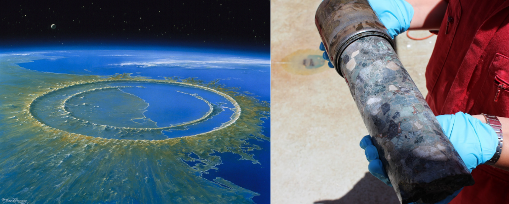

# Classifying Core Images from the Chixulub Impact Crater

Source: DETLEV VAN RAVENSWAAY/SCIENCE SOURCE/IODP EXP 364

This repo contains notebooks that implement the hypercolumn 'Deep Feature'
core image classification scheme presented in my [SciPy 2020 talk](https://www.youtube.com/playlist?list=PLYx7XA2nY5GfY4WWJjG5cQZDc7DIUmn6Z).

IODP/ICDP [Expedition 364](http://publications.iodp.org/proceedings/364/364title.html) extracted ~830m of core from the peak ring of the Chixulub impact structure.  This core provides dramatic evidence of how the crater was formed, and the processes that affected the resulting environmental changes.  A section of core just above the K-Pg boundary consists of impactites with many different rock fragments and melt.  This repo contains Python notebooks that use machine learning to classify these different rock fragments, or clasts.

The technique uses sparse labels supplied by a geoscientist.  It requires a couple examples for each different class.  [Ilastik](https://www.ilastik.org/) was used to annotate clasts in the image for training.

This example uses core line scan image dataset made available by:
> IODP Expedition 364 Scientists (2017): Line scan images of IODP Hole 364-M0077A. PANGAEA, https://doi.org/10.1594/PANGAEA.881718 

which is licensed CC-BY 3.0.

### References
- Morgan et al. (2016) The formation of peak rings in large impact craters, [Science 354(6314).](https://science.sciencemag.org/content/354/6314/878)
- Gulick et al. (2019) The first day of the Cenozoic, [PNAS 116 (39).](https://www.pnas.org/content/116/39/19342)
- Ormö et al. (2007) Sedimentological analysis of resurge deposits at the Lockne and Tvären craters: Clues to flow dynamics, [Met. & Pl. Sc. 42(11).](https://onlinelibrary.wiley.com/doi/abs/10.1111/j.1945-5100.2007.tb00551.x)
- Rae et al. (2019). Impact‐induced porosity and microfracturing at the Chicxulub impact structure. [JGR: Planets.](https://agupubs.onlinelibrary.wiley.com/doi/epdf/10.1029/2019JE005929)
### Media:
- BBC Documentary, [“The Day the Dinosaurs Died”](https://www.bbc.co.uk/programmes/b08r3xhf)
- Sean Gulick’s [SciPy 2017 Talk](https://www.youtube.com/watch?v=_2iCNqe9_cY)
